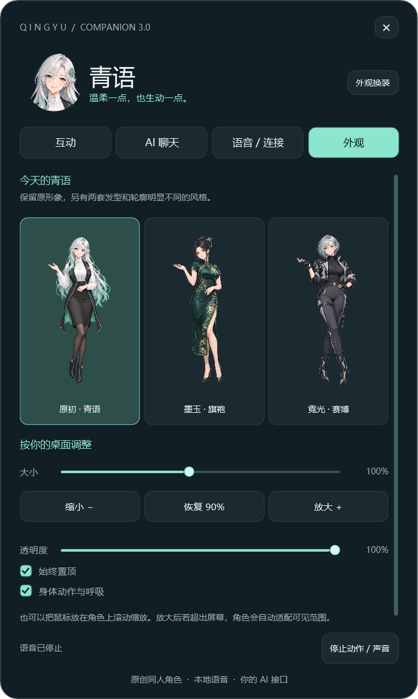

# 青语桌宠 QingyuPet

青语是一款运行在 Windows 桌面的二次元 AI 伙伴。她可以与你进行桌面互动，通过本地离线语音朗读回复，并连接 DeepSeek 或其他兼容 OpenAI Chat Completions 的 AI 服务。聊天内容会驱动角色的表情和动作，让文字、声音与角色表现保持联动。

当前版本：**3.0**

> 青语是原创成年动漫角色与非官方项目，与 OpenAI、DeepSeek 等服务提供商没有隶属或授权关系。



## 功能特点

- 支持 DeepSeek 和兼容 OpenAI Chat Completions 格式的 AI 接口；
- AI 文字流式显示，并根据语境触发表情与动作；
- 使用 MeloTTS 与 sherpa-onnx 在本机离线合成中文语音；
- 按句准备和播放声音，可以随时打断，口型跟随实际音频变化；
- 内置招手、点头、歪头、眨眼、蹦跳、舞蹈、摸头、喝茶等 18 种互动；
- 提供原初青语、墨玉旗袍、霓光赛博三套差异化形象；
- 支持拖动、45%–165% 缩放、透明度、置顶和屏幕边界自动适配；
- API Key 使用 Windows DPAPI 按当前用户加密保存。

## 系统要求

- Windows 10 或 Windows 11，64 位；
- .NET Framework 4.8；
- 约 250 MB 可用磁盘空间；
- 使用 AI 聊天时需要网络和自己的 API Key。

本地语音、角色动作和外观功能可以离线使用。运行便携版不需要 Python、Visual Studio 或其他开发工具。

## 快速开始

1. 完整解压 [`青语桌宠-3.0-Windows便携版.zip`](青语桌宠-3.0-Windows便携版.zip)。
2. 双击解压目录中的 `QingyuPet.exe`。
3. 保留程序旁边的 `voice` 文件夹，否则本地语音无法加载。
4. 双击桌宠打开主面板；再次运行程序或双击托盘图标可召回角色。

也可以直接运行 [`QingyuPet-v3/QingyuPet.exe`](QingyuPet-v3/QingyuPet.exe)。完整操作说明见 [`使用说明.txt`](QingyuPet-v3/使用说明.txt)。

| 操作 | 效果 |
| --- | --- |
| 按住角色拖动 | 移动角色，松开后保存位置 |
| 双击角色 | 打开互动与聊天面板 |
| 在角色上滚动滚轮 | 放大或缩小角色 |
| 右键角色 | 打开互动、换装、复位、收起和退出菜单 |
| 面板右上角 `×` 或 `Esc` | 关闭面板，桌宠继续运行 |
| “停止动作 / 声音” | 停止当前回复、语音和动作 |

## 配置 AI 聊天

打开主面板，进入 **AI 聊天**，点击 **配置接口 / 读取可用模型**。

以 DeepSeek 为例：

1. API 地址填写 `https://api.deepseek.com`；
2. 输入自己的 API Key；
3. 点击 **读取可用模型**，选择账号实际返回的模型；
4. 保存配置并点击 **测试连接**；
5. 返回聊天页输入消息，`Enter` 发送，`Shift + Enter` 换行。

项目已针对 DeepSeek 官方地址处理模型名称兼容问题。3.0 版本实测可读取 `deepseek-flash` 和 `deepseek-v4-pro`，实际可用模型以账号返回结果为准。

其他服务可以填写其 OpenAI 兼容基础地址或完整的 Chat Completions 地址。程序使用 HTTPS/TLS 1.2，并区分密钥权限、余额、限流、地址和模型等常见错误。

AI 返回的动作信息只允许选择程序内置动作，不会执行模型生成的代码、脚本或任意桌面命令。聊天仅在内存中保留最近 6 轮成功对话，关闭程序后不会保存对话记录。

## 本地语音

本地语音使用 [MeloTTS](https://github.com/myshell-ai/MeloTTS) 中文模型和 [sherpa-onnx](https://github.com/k2-fsa/sherpa-onnx) 原生接口。

当前测试电脑上的结果：

- 首次加载并合成短句约需 4.2–5.6 秒；
- 模型常驻后的不同短句约需 1.0–1.5 秒；
- 连续回复支持分句合成、播放和中途打断；
- 口型根据实际音频能量变化，播放结束后自动闭合。

测试时间不包含 AI 推理和网络延迟。当前情绪语音通过语速、轻微音高和措辞节奏进行调整；Melo 模型本身没有原生情感控制，因此仍会保留一定合成音色。

## 外观与互动

- **原初·青语**：银白长发与薄荷渐变；
- **墨玉·旗袍**：深色盘发和墨绿刺绣长旗袍；
- **霓光·赛博**：银色短发、黑色机能服与长靴。

三套形象均支持眨眼、嘴部开合、六种主要表情和全身动作。当前实现属于二维分层动画，不是 Live2D，也不是逐音素口型。

## 从源码构建

使用 [`青语桌宠-3.0-源码.zip`](青语桌宠-3.0-源码.zip)，或进入工作区中的 `work/pet-v3`：

1. 确认系统已经安装 .NET Framework 4.8；
2. 将便携版的 `voice` 文件夹复制到源码的 `bin` 目录，或使用 Python 3.12+ 运行 `download-voice.py`；
3. 双击 `build.cmd`，或在 PowerShell 运行 `./build.ps1`；
4. 启动 `./bin/QingyuPet.exe`。

项目使用 Windows 自带的 C# 编译器构建，目标为 x64、C# 5 和 WPF，没有额外的 NuGet 构建依赖。

核心代码结构：

```text
work/pet-v3/
├─ QingyuPet.cs           # 设置、桌宠窗口与 WPF 工具
├─ PetApp.cs              # 生命周期、托盘、保存与情绪联动
├─ CompanionWindow.cs     # 互动、聊天、连接与外观界面
├─ AnimatedRig.cs         # 表情、口型、动作与角色形象
├─ ChatService.cs         # API、SSE 流式回复和错误处理
├─ ChatProtocol.cs        # 情绪/动作协议与白名单
├─ VoiceService.cs        # 分句队列、播放、缓存和口型驱动
├─ ResidentVoice.cs       # 常驻本地语音引擎
├─ native/                # sherpa-onnx C API 配置结构
├─ assets/                # 角色、表情、服装与图标
├─ V3Tests.cs             # 界面、换装、聊天和语音集成测试
├─ ServiceTests.cs        # 接口、安全、DPAPI 与音频测试
└─ build.cmd              # Windows 构建入口
```

## 测试与验证

应用提供 `--v3-test`、`--services-test`、`--playback-test` 和 `--smoke-test` 四个测试入口，覆盖聊天到动作联动、界面与换装、API 错误处理、密钥保护、真实本地语音、口型播放、托盘和单实例运行。

3.0 交付版已通过完整集成检查，并完成 DeepSeek 模型列表与短句流式回复验证。测试输出不会记录 API Key。详细结果见 [`TEST-RESULTS.txt`](QingyuPet-v3/TEST-RESULTS.txt) 和 [`青语桌宠-3.0-验证报告.txt`](青语桌宠-3.0-验证报告.txt)。

## 数据与隐私

| 数据 | 默认位置 |
| --- | --- |
| 用户配置 | `%LOCALAPPDATA%\QingyuPet\settings.json` |
| 本地语音缓存 | `%LOCALAPPDATA%\QingyuPet\voice-cache` |
| 异常日志 | `%LOCALAPPDATA%\QingyuPet\error.log` |

语音缓存最多保留约 160 个 WAV 文件或 128 MB。程序启动不会自动发起 AI 聊天请求，也不会访问麦克风。网络请求只发送到用户配置的聊天接口。

## 已知限制

- 仅支持 Windows x64 和 .NET Framework 4.8；
- 本地语音第一次加载仍需数秒，并会占用较多内存；
- 情绪声音属于基础音高和速度处理，并非专门训练的情感语音模型；
- 二维程序化动画无法达到完整 Live2D 骨骼动画的细节；
- 当前不支持麦克风语音输入、实时语音通话或开机自启。

## 第三方组件与许可

项目使用 MeloTTS 模型、sherpa-onnx、ONNX Runtime、eSpeak NG 等第三方组件。各组件采用各自许可，完整许可文本、修改说明和对应上游源码位于 `QingyuPet-v3/licenses`、`QingyuPet-v3/upstream-source` 和 [`THIRD-PARTY-NOTICES.md`](QingyuPet-v3/THIRD-PARTY-NOTICES.md)。

角色图像为本项目生成的原创成年动漫人物素材，生成说明记录在源码中的 `ART_PROMPT-v3.md`。
